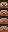

# mcanitexgen (MC animated texture generator)
Mcanitexgen is a python generator for complex animated textures. It generates .mcmeta files from .animation.yml files.

## Install
`pip install mcanitexgen`

## Usage
`python -m anitexgen <dir>` where `dir` is the a directory containing animation files.
Parses all animation files (.animation.yml) in the directory and generates .mcmeta files from them.

## Simple Example
A simple animation where a head blinks, then winks with the left eye and then with the right eye.
<br>
First we create all the different frames of the animation. I'm going to call them "states" here, to not confuse them with the frames of the final product.<br>
<br>


As you can see, our animation has a total of 4 states. but of course we don't want to play them in the order from top to bottom, that would look strange.
Instead we create an animation file that references the states.
<br>
```yaml
head:
  texture: "<rel_path>/head.png" # Relative path to the texture
  
  # A list of the textures states. Useful to give your states meaningful names.
  states: 
    - normal
    - blink_both # Blinking with both eyes
    - wink_left # Blinking with only the left eye
    - wink_right # Blinking with only the right eye
  
  # A list of sequences that can be played in the animation.
  sequences:
    look_n_blink: # A sequence where the head first looks normal and then blinks shortly
      - { state: normal, duration: 20 }
      - { state: blink, duration: 3 }
  
  # The final animation
  animation: 
    - { sequence: look_n_blink, repeat: 3 } # References the 'look_n_blink' sequence and plays it 3 times
    - { state: wink_left, duration: 10 }
    - { sequence: look_n_blink }
    - { state: normal, duration: 20 }
    - { state: wink_right, duration: 10 }
```
Mcanitexgen then generates the output "<rel_path>/head.png.mcmeta" which Minecraft uses to animate textures.<br>
<br>
More complex examples can be found in `/examples`.