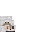
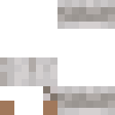

# Dog animation


A complex 3 part animation:
- Head: Looks around -> Falls asleep -> Wakes up -> Pants -> Tilts its head
- Tail and hindlegs: Kicks with legs -> Does nothing -> Wags tail
- Dream bubble: Appears while the head is in the sleep animation. Pops when the dog wakes up

Each texture animates one part of a custom dog model.

## Animation file (complete file [here](dog.animation.py))
```python
@animation("head.png")
class Head(TextureAnimation):
    NEUTRAL = State(0)
    TILTED = State(1)
    DOWN = State(2)
    BLINK = State(3)
    MOUTH_OPEN = State(4)
    ONE_EYE = State(5)
    ...
    main = Sequence(
            bored,
            fall_asleep,
            asleep(duration=600, mark="asleep"),
            wake_up,
            happy,
            curious(duration=400),
            NEUTRAL(duration=20),
        )
...
@animation("tail_and_hindlegs.png")
class TailAndHindlegs(TextureAnimation):
    TAIL_HIGH = State(0)
    TAIL_NEUTRAL = State(1)
    TAIL_LOW = State(2)
    LEG_LEFT_HIGH = State(3)
    LEG_RIGHT_HIGH = State(4)
...
@animation("dream.png")
class Dream(TextureAnimation):
    NONE = State(0)
    APPEAR1 = State(1)
    APPEAR2 = State(2)
    EMPTY_BUBBLE = State(3)
    STEAK_GROUND = State(4)
    STEAK_JUMPING = State(5)
    POP1 = State(6)
    POP2 = State(7)
...
```

## Textures
<table>
  <tr>
    <th>head.png</th>
    <th>tail_and_hindlegs.png</th>
    <th>dream.png</th>
  </tr>
  <tr>
    <th></th>
    <th></th>
    <th></th>
  </tr>
</table>

## Animated textures
<table>
  <tr>
    <th>head</th>
    <th>tail_and_hindlegs</th>
    <th>dream</th>
  </tr>
  <tr>
    <th></th>
    <th></th>
    <th></th>
  </tr>
</table>

These are the resulting animated textures (rendered as a gif for visualization)
