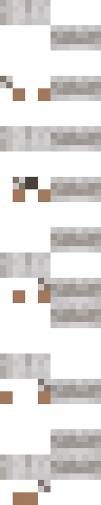

# Dog animation

A complex 3 part animation:
- Head: Looks around -> Falls asleep -> Wakes up -> Pants -> Tilts its head
- Tail and hindlegs: Kicks with legs -> Does nothing -> Wags tail
- Dream bubble: Appears while the head is in the sleep animation. Pops when the dog wakes up

Each texture animates one part of a custom dog model.

## Textures

