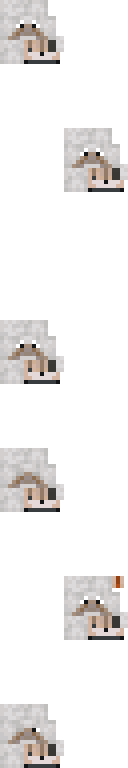

# Dog animation

A complex 3 part animation:
- Head: Looks around -> Falls asleep -> Wakes up -> Pants -> Tilts its head
- Tail and hindlegs: Kicks with legs -> Does nothing -> Wags tail
- Dream bubble: Appears while the head is in the sleep animation. Pops when the dog wakes up

Each texture animates one part of a custom dog model.

## Textures
<table>
  <tr>
    <th>head.png</th>
    <th>tail_and_hindlegs.png</th>
    <th>dream.png</th>
  </tr>
  <tr>
    <th></th>
    <th></th>
    <th></th>
  </tr>
</table>

## Animated textures
<table>
  <tr>
    <th>head</th>
    <th>tail_and_hindlegs</th>
    <th>dream</th>
  </tr>
  <tr>
    <th></th>
    <th></th>
    <th></th>
  </tr>
</table>

These are the resulting animated textures (rendered as a gif for visualization)
