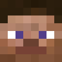
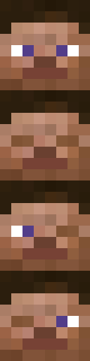

# Steve animation


A very simple animation with only one texture, no weights and no references.

## Animation file
```python
from mcanitexgen import Sequence, State, TextureAnimation, animation

@animation("steve.png")
class Steve(TextureAnimation):
    NORMAL = State(0)  # Look normal
    BLINK = State(1)
    WINK_RIGHT = State(2)  # Wink with right eye
    WINK_LEFT = State(3)  # Wink with left eye

    # Look normal and blink shortly
    look_and_blink = Sequence(NORMAL(duration=60), BLINK(duration=2))

    # The main Sequence used to create the animation
    main = Sequence(
        3 * look_and_blink,  # Play "look_and_blink" Sequence 3 times
        NORMAL(duration=60),
        WINK_LEFT(duration=30),
        look_and_blink,
        NORMAL(duration=60),
        WINK_RIGHT(duration=30),
    )
```

## Textures

